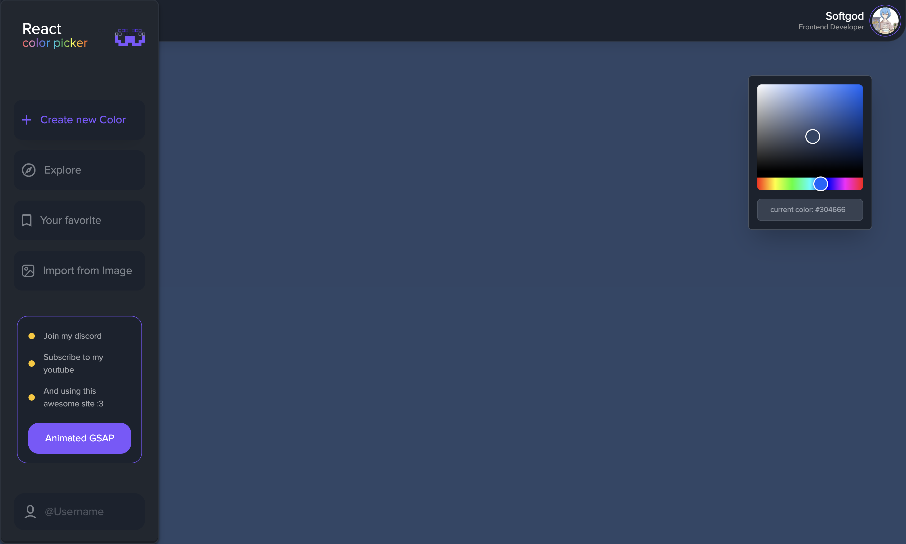

# Color Picker Website

A modern web application for picking and managing colors. Built with React and various front-end technologies to provide a smooth and interactive user experience.

## Technologies Used

### React
- **Pros**: Efficient and flexible JavaScript library for building user interfaces. Offers a component-based architecture that makes it easy to build interactive UIs and manage state.

### GSAP
- **Pros**: A powerful library for creating high-performance animations. Provides robust tools for animating elements, with fine control over animation sequences and easing.

### React Colorful
- **Pros**: A lightweight and customizable color picker component for React. Offers a simple API and a variety of color formats, enhancing the user experience for selecting colors.

### Sass
- **Pros**: A CSS preprocessor that adds features like variables, nesting, and mixins to CSS, making stylesheets more maintainable and modular. It helps in writing clean and organized CSS.

### Tailwind CSS
- **Pros**: A utility-first CSS framework that allows for rapid UI development. Provides a set of utility classes that can be combined to build custom designs without leaving the HTML.

### Vite
- **Pros**: A fast build tool that offers an optimized development experience. Provides fast hot module replacement (HMR) and builds for production quickly, improving development speed.

### Zustand
- **Pros**: A small and fast state management tool for React. Provides a simple API for managing state without the boilerplate typically associated with more complex state management solutions.

## Screenshot



## Getting Started

1. **Clone the Repository**

   ```bash
   git clone https://github.com/yourusername/color-picker-website.git
   cd color-picker-website
   ```

2. **Install Dependencies**

   ```bash
   npm install
   ```

3. **Run the Development Server**

   ```bash
   npm run dev
   ```

   The app will be available at `http://localhost:5173`.

4. **Build for Production**

   ```bash
   npm run build
   ```

## Contributing

Feel free to submit issues, contribute code, or suggest improvements. Please follow the coding style and ensure that tests are passing before submitting pull requests.

## License

This project is licensed under the MIT License - see the [LICENSE](LICENSE) file for details.